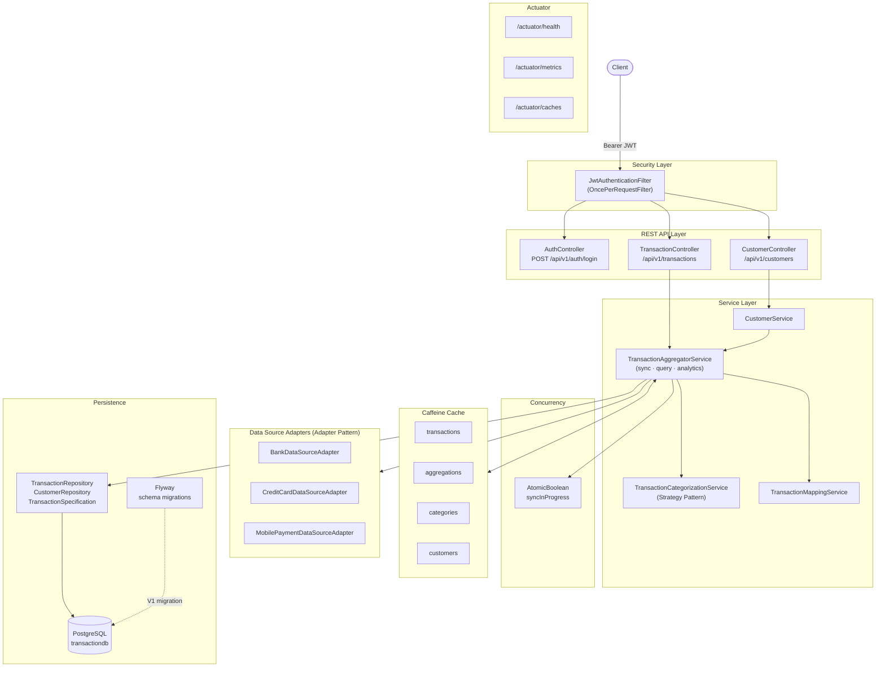
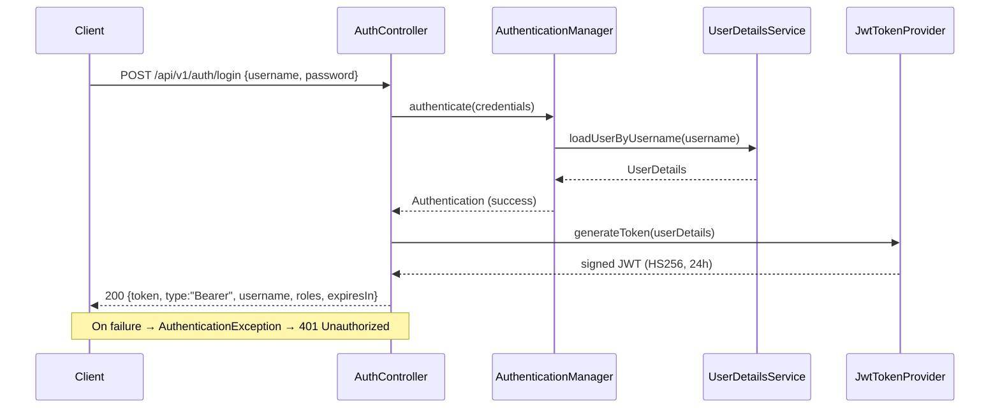
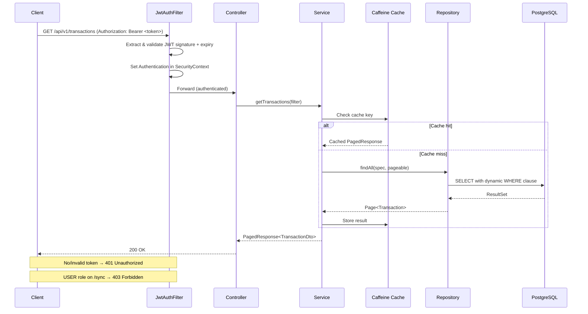
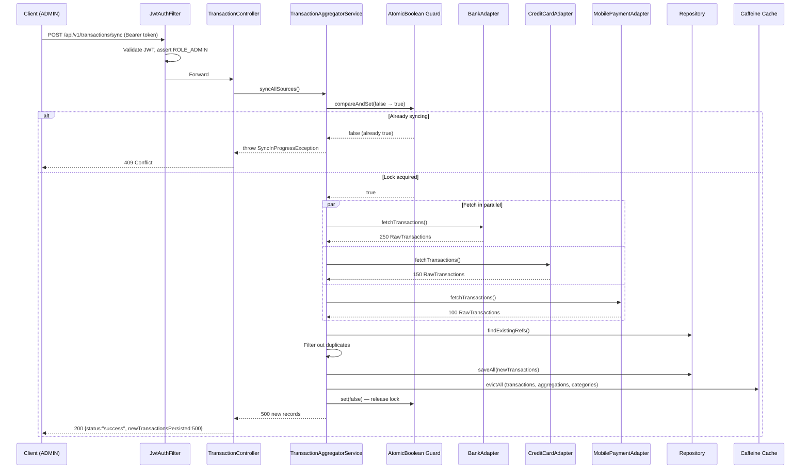

# Transaction Aggregator API

A production-grade Spring Boot 3.2 REST API that aggregates customer financial transaction data
from multiple mock data sources (Bank, Credit Card, Mobile Payment), categorizes each transaction
using a rule-based engine, and exposes an extensive analytics API secured with JWT authentication.

Built as a technical assessment for **Capitec Bank**.

---

## Architecture



### Design Patterns

- **Adapter Pattern**: Each data source (`BankDataSourceAdapter`, `CreditCardDataSourceAdapter`,
  `MobilePaymentDataSourceAdapter`) implements the `DataSourceAdapter` interface, adapting the
  source's specific format into a unified `RawTransaction` model.

- **Strategy Pattern**: `TransactionCategorizationService` encapsulates keyword-based categorization
  rules. The implementation can be swapped without changing callers, enabling alternative strategies
  (e.g. ML-based categorization).

- **Repository + Specification Pattern**: `TransactionSpecification` builds dynamic JPA Criteria
  predicates from a `TransactionFilterRequest`, enabling type-safe dynamic queries without
  string concatenation.

---

## Sequence Diagrams

### 1. Authentication Flow



### 2. Authenticated Request Flow



### 3. Data Sync Flow



---

## Prerequisites

| Tool | Version |
|------|---------|
| Java | 21+ |
| Maven | 3.9+ |
| PostgreSQL | 15+ |
| Docker | 24+ (optional, alternative to local PostgreSQL) |

---

## Running the Application

### Option 1: PostgreSQL + Maven (default)

```bash
# Ensure PostgreSQL is running with database 'transactiondb'
# Connection: localhost:5432, user: postgres, password: postgres

mvn spring-boot:run
# API starts on http://localhost:8080
```

### Option 2: Docker Compose (PostgreSQL + App)

```bash
docker-compose up --build
# Starts PostgreSQL and the API together
```

### Option 4: JAR

```bash
mvn clean package -DskipTests
java -jar target/transaction-aggregator-api-1.0.0.jar
```

---

## Authentication

All API endpoints (except `/api/v1/auth/login`, `/swagger-ui/**`, `/api-docs/**`, `/actuator/health`) require a valid JWT token.

### Step 1 — Obtain a token

```bash
curl -X POST "http://localhost:8080/api/v1/auth/login" \
  -H "Content-Type: application/json" \
  -d '{"username":"user","password":"user123"}'
```

Response:
```json
{
  "token": "eyJhbGci...",
  "type": "Bearer",
  "username": "user",
  "roles": ["ROLE_USER"],
  "expiresIn": 86400000
}
```

### Step 2 — Use the token

```bash
TOKEN="eyJhbGci..."
curl "http://localhost:8080/api/v1/transactions" \
  -H "Authorization: Bearer $TOKEN"
```

### Credentials

| Username | Password | Role | Access |
|----------|----------|------|--------|
| `admin` | `admin123` | ADMIN | Full access including sync |
| `user` | `user123` | USER | Read-only (no sync) |

---

## API Documentation

After starting the application:

- **Swagger UI**: http://localhost:8080/swagger-ui.html — click **Authorize** to paste a JWT token
- **OpenAPI JSON**: http://localhost:8080/api-docs

---

## Mock Data

On startup, the `DataSourceInitializer` seeds 5 customers and triggers a full data sync from all adapters:

| Source | Transactions/Customer | Focus |
|--------|----------------------|-------|
| BANK | ~50 | Salary, groceries, utilities, transfers |
| CREDIT_CARD | ~30 | Dining, entertainment, shopping |
| MOBILE_PAYMENT | ~20 | Transport (Uber/Bolt), small transfers, dining |

**Total on startup**: ~500 transactions across 5 South African customers (CUST001-CUST005).

---

## API Reference

All examples below assume `TOKEN` is set to a valid JWT (see Authentication above).

### Authentication

```bash
# Login (public — no token required)
curl -X POST "http://localhost:8080/api/v1/auth/login" \
  -H "Content-Type: application/json" \
  -d '{"username":"user","password":"user123"}'
```

### Transaction Endpoints (`/api/v1/transactions`)

```bash
# List all transactions (paginated)
curl "http://localhost:8080/api/v1/transactions" -H "Authorization: Bearer $TOKEN"

# Filter by customer and category
curl "http://localhost:8080/api/v1/transactions?customerId=CUST001&category=GROCERIES" \
  -H "Authorization: Bearer $TOKEN"

# Filter by date range
curl "http://localhost:8080/api/v1/transactions?dateFrom=2024-01-01T00:00:00&dateTo=2024-06-30T23:59:59" \
  -H "Authorization: Bearer $TOKEN"

# Get by UUID
curl "http://localhost:8080/api/v1/transactions/{uuid}" -H "Authorization: Bearer $TOKEN"

# Get by reference
curl "http://localhost:8080/api/v1/transactions/ref/BANK-CUST001-SAL-001" \
  -H "Authorization: Bearer $TOKEN"

# Sync (ADMIN only)
curl -X POST "http://localhost:8080/api/v1/transactions/sync" \
  -H "Authorization: Bearer $ADMIN_TOKEN"

# Aggregation summary
curl "http://localhost:8080/api/v1/transactions/aggregate" -H "Authorization: Bearer $TOKEN"

# Category breakdown
curl "http://localhost:8080/api/v1/transactions/categories/summary" -H "Authorization: Bearer $TOKEN"

# Monthly trends (last 12 months)
curl "http://localhost:8080/api/v1/transactions/trends/monthly" -H "Authorization: Bearer $TOKEN"

# Per-source summary
curl "http://localhost:8080/api/v1/transactions/sources/summary" -H "Authorization: Bearer $TOKEN"
```

### Customer Endpoints (`/api/v1/customers`)

```bash
curl "http://localhost:8080/api/v1/customers" -H "Authorization: Bearer $TOKEN"
curl "http://localhost:8080/api/v1/customers/CUST001" -H "Authorization: Bearer $TOKEN"
curl "http://localhost:8080/api/v1/customers/CUST001/transactions" -H "Authorization: Bearer $TOKEN"
curl "http://localhost:8080/api/v1/customers/CUST001/summary" -H "Authorization: Bearer $TOKEN"
curl "http://localhost:8080/api/v1/customers/CUST001/categories/summary" -H "Authorization: Bearer $TOKEN"
curl "http://localhost:8080/api/v1/customers/CUST001/trends/monthly" -H "Authorization: Bearer $TOKEN"
```

---

## Running Tests

Tests use mocked services (`@WebMvcTest`) and pure unit tests — no database connection required.

```bash
# Run all tests
mvn test

# Run specific test class
mvn test -Dtest=TransactionCategorizationServiceTest
mvn test -Dtest=TransactionAggregatorServiceTest
mvn test -Dtest=TransactionControllerTest
mvn test -Dtest=CustomerControllerTest
mvn test -Dtest=AuthControllerTest
```

### Test Coverage

| Test Class | Tests | Description |
|------------|-------|-------------|
| `TransactionCategorizationServiceTest` | 54 | Every category keyword, edge cases, case insensitivity |
| `TransactionAggregatorServiceTest` | 13 | Sync, deduplication, aggregation with mocked adapters |
| `TransactionControllerTest` | 12 | `@WebMvcTest` — all endpoints, auth, role enforcement |
| `CustomerControllerTest` | 30 | `@WebMvcTest` — all customer endpoints, 404 cases |
| `AuthControllerTest` | 6 | Login success (admin/user), 401 on bad creds, 400 on blank fields |

---

## Transaction Categories

Categorization is keyword-based (case-insensitive match on description + merchant name):

| Category | Keywords / Merchants |
|----------|---------------------|
| SALARY | salary, payroll, remuneration |
| GROCERIES | woolworths food, pick n pay, checkers, spar, food lovers, freshstop |
| UTILITIES | eskom, city power, telkom, vodacom, mtn, rain, fibre, electricity |
| ENTERTAINMENT | netflix, showmax, dstv, spotify, apple music, ster-kinekor |
| TRANSPORT | uber, bolt, shell, engen, bp, caltex, fuel, gautrain |
| DINING | restaurant, kfc, mcdonalds, steers, wimpy, nando's, spur, ocean basket, coffee, uber eats |
| HEALTHCARE | clicks pharmacy, dischem, hospital, mediclinic, doctor, medical aid |
| SHOPPING | takealot, amazon, mr price, woolworths fashion, h&m, zara, edgars |
| TRANSFER | transfer, eft, payshap, snapscan, home loan, vehicle finance |
| OTHER | anything that doesn't match the above |

---

## Technology Stack

| Layer | Technology |
|-------|-----------|
| Language | Java 21 |
| Framework | Spring Boot 3.2.3 |
| Security | Spring Security 6 + JJWT 0.12 (JWT / HS256) |
| ORM | Spring Data JPA / Hibernate 6 |
| Database | PostgreSQL 18 |
| Schema Migrations | Flyway 9 |
| Caching | Caffeine (4 caches: transactions, aggregations, categories, customers) |
| API Docs | SpringDoc OpenAPI 2.3 (Swagger UI) |
| Observability | Spring Boot Actuator (health, metrics, caches) |
| Testing | JUnit 5 + Mockito + Spring Security Test |
| Build | Maven 3.9 |
| Container | Docker + Docker Compose |

---

## Configuration

### Database

PostgreSQL is the only supported database. Ensure it is running at `localhost:5432` with database `transactiondb` before starting the application.

Tests (`mvn test`) do not connect to the database — all controller tests use mocked services and unit tests have no Spring context.

### Key Properties

```yaml
app:
  data-sources:
    sync-on-startup: true   # set false to skip auto data load
  security:
    jwt:
      secret: <min 32-char secret>
      expiration: 86400000  # 24 hours in ms
```
