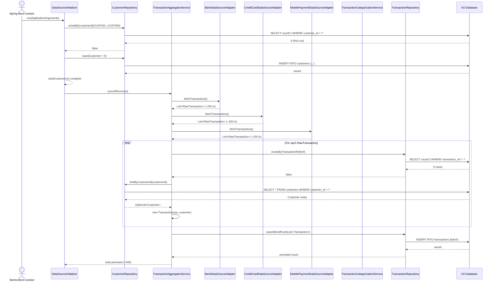
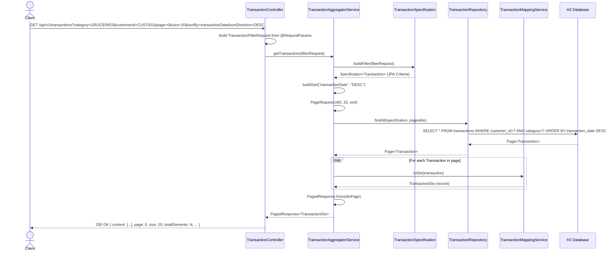
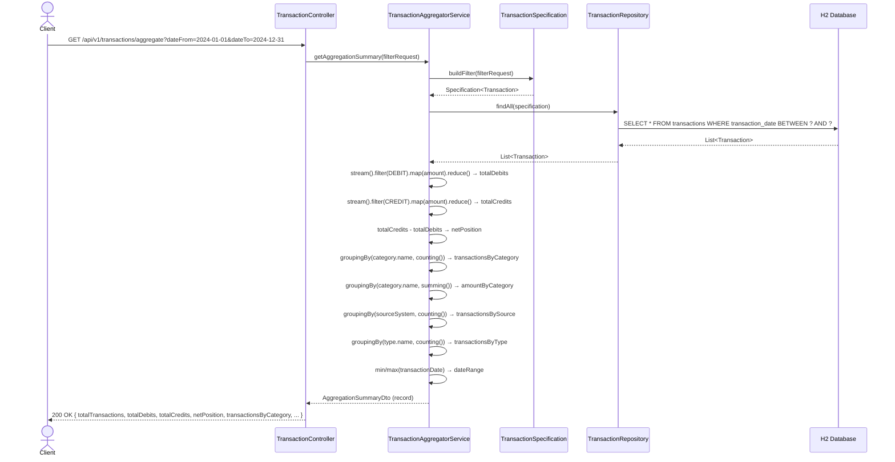
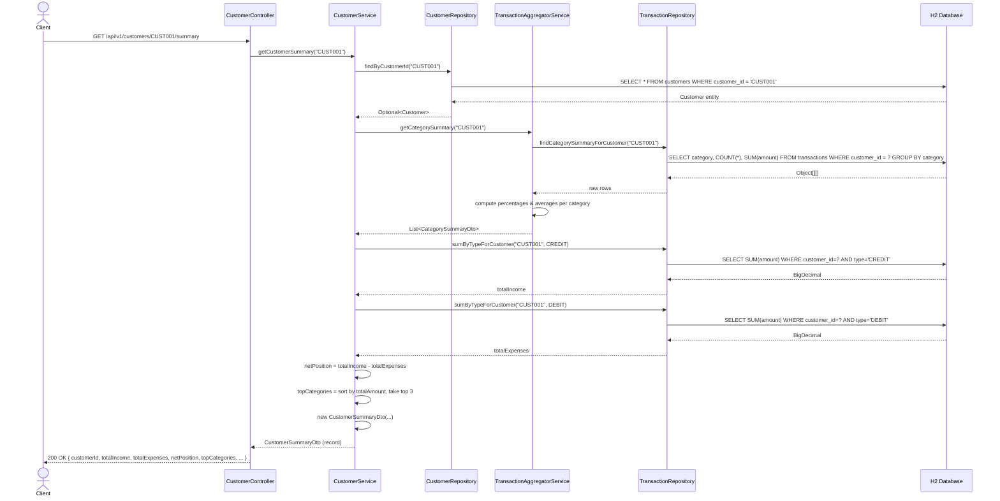
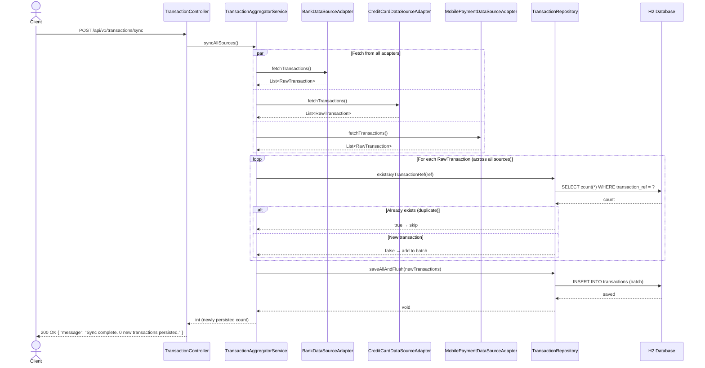
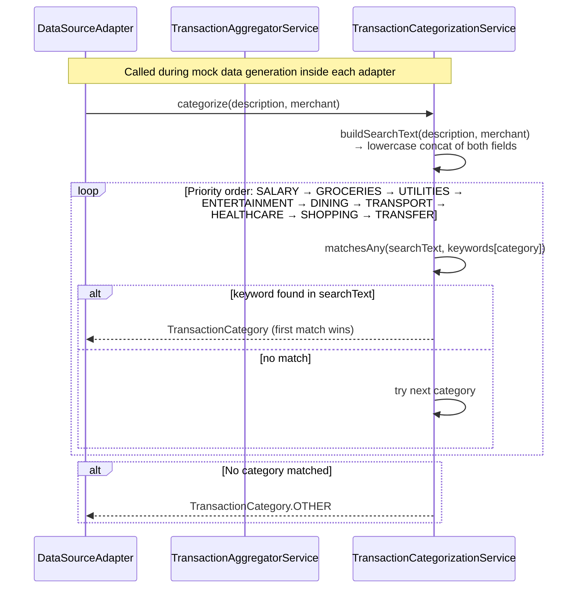

# Transaction Aggregator API — Sequence Diagrams

---

## 1. Application Startup & Data Sync

---

## 2. GET /api/v1/transactions (Filtered & Paginated)

---

## 3. GET /api/v1/transactions/aggregate (Aggregation Summary)

---

## 4. GET /api/v1/customers/{customerId}/summary (Customer Financial Summary)

---

## 5. POST /api/v1/transactions/sync (Manual Re-sync)

---

## 6. Transaction Categorization Flow (Strategy Pattern)

